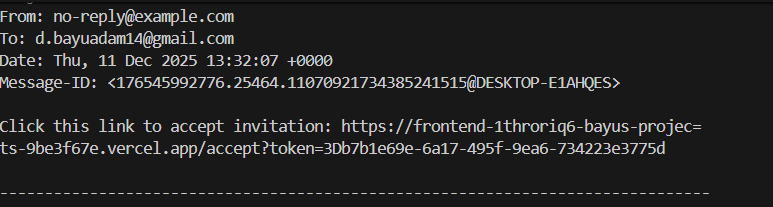

# 📄 Admin Portal — Django + Next.js

## Overview
Admin Portal sederhana dengan **RBAC (Role-Based Access Control)** dan **User Invitation Flow**.

- **Backend:** Django + Django REST Framework + JWT  
- **Frontend:** Next.js + Ant Design  
- **Roles:** Admin, Manager, Staff

### Fitur Utama
- JWT Authentication  
- CRUD Products & Orders (akses sesuai role)  
- Dashboard + menu dinamis sesuai role  
- Invitation via email (mock)  
- Accept invitation → create user + auto role  
- User Management (edit, delete, resend invite, revoke invite)

---

## 1. Folder Structure
```
admin-portal/
├── backend/        # Django backend + seed.py + requirements.txt
├── frontend/       # Next.js + Ant Design frontend
└── README.md
```

---

## 2. Backend Setup (Django)

### Prerequisites
- Python 3.10+
- pip
- virtualenv

### Installation & Run
```bash
cd backend
python -m venv venv

# Windows
venv\Scripts\activate

# Mac/Linux
source venv/bin/activate

pip install -r requirements.txt
python manage.py makemigrations
python manage.py migrate

# Seed demo data
python seed.py

# Run server
python manage.py runserver
```

Backend URL: `http://127.0.0.1:8000/`  
API root: `/api/`

---

## 3. Frontend Setup (Next.js)

### Installation & Run
```bash
cd frontend
npm install
npm run dev
```

Frontend URL: `http://localhost:3000`

---

## 4. Demo Accounts

| Role    | Username  | Password        |
|---------|-----------|-----------------|
| Admin   | admin     | AdminPass123    |
| Manager | manager1  | ManagerPass123  |
| Staff   | staff1    | StaffPass123    |

> Menu & dashboard otomatis mengikuti role.

---

## 5. Invitation Flow (Admin / Manager)

### Langkah-langkah
1. Login sebagai **Admin / Manager**
2. Buka menu **Invite Users**
3. Masukkan email + role
4. Klik **Send Invitation**
5. Backend menampilkan mock email:
```
Click this link to accept invitation:
http://localhost:3000/accept?token=<uuid-token>
```
6. Buka link → isi username + password  
7. User baru dapat login sesuai role

### Token Rules
- Berlaku **72 jam**
- **Single Use**
- Revoke → token invalid

### Aksi UI
| Action | Admin | Manager |
|--------|--------|----------|
| Send Invitation | ✔ | ✔ |
| Resend Invitation | ✔ | ✔ |
| Revoke Invitation | ✔ | ✔ |
| Delete Invitation | ✔ | ✖ |

---

## 6. User Management

### Halaman: `/users`
Menampilkan list user + status invitation.

### Role Permissions
| Role    | Edit User | Delete User | Resend Invite | Revoke Invite |
|---------|-----------|-------------|---------------|----------------|
| Admin   | ✔         | ✔           | ✔             | ✔              |
| Manager | ✔         | ✖           | ✔             | ✔              |
| Staff   | ✖         | ✖           | ✖             | ✖              |

---

## 7. Role-Based Access (Products & Orders)

| Role    | Products | Orders | Invite Users |
|---------|---------|--------|--------------|
| Admin   | CRUD    | CRUD   | Yes          |
| Manager | CRUD    | Read   | Yes          |
| Staff   | Read    | Read   | No           |

---

## 8. Accept Invitation Flow

Endpoint: `/accept?token=XXXX`

Flow:
1. User membuka link
2. Mengisi username + password
3. Backend membuat user baru
4. Token diberi status `used`
5. Redirect ke halaman login

---

## 9. API Overview

### Auth
- `POST /api/auth/login/`
- `POST /api/auth/refresh/`

### Users
- `GET /api/users/`
- `POST /api/users/`
- `PUT /api/users/<id>/`
- `DELETE /api/users/<id>/` *(Admin only)*

### Invitations
- `GET /api/invitations/`
- `POST /api/invitations/`
- `POST /api/invitations/<id>/resend/`
- `POST /api/invitations/<id>/revoke/`
- `DELETE /api/invitations/<id>/` *(Admin only)*

---

## 10. Feature Testing Checklist
- Login / Logout  
- Dashboard dynamic  
- Products CRUD (Admin/Manager)  
- Orders read-only untuk Staff  
- Create invitation  
- Resend / revoke invitation  
- Accept invitation  
- User management (edit/delete sesuai role)  

---

## 11. GitHub Instructions

```bash
# Clone repository
git clone <REPO_URL>
cd admin-portal

# Backend setup
cd backend
python -m venv venv
pip install -r requirements.txt
python manage.py migrate
python seed.py
python manage.py runserver

# Frontend setup
cd ../frontend
npm install
npm run dev
```

- Backend: `http://127.0.0.1:8000/`  
- Frontend: `http://localhost:3000`

---

## 12. Notes
- Email sistem masih mock (via console)  
- JWT disimpan di localStorage  
- Invitation token: expired 72h + single use  
- CORS sudah disiapkan  
- Seed script menyediakan demo accounts + sample data  


## 13 Deploy Link
---
https://frontend-eight-iota-46.vercel.app/
---
## Console Link Invitation 




